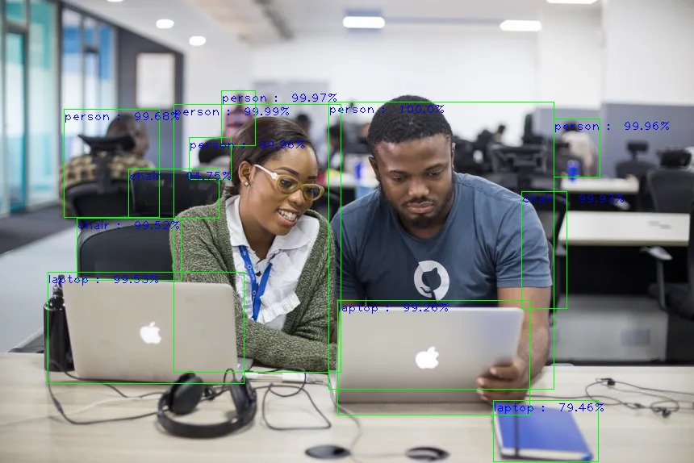

# Image Object Detection using ImageAI

This repository contains an object detection project using ImageAI with various models including RetinaNet, YOLOv3, and TinyYOLOv3.


## Models Included

- **RetinaNet**: Trained on COCO dataset.
  - Model File: [RetinaNet Model - retinanet_resnet50_fpn_coco-eeacb38b.pth](https://github.com/OlafenwaMoses/ImageAI/releases/download/3.0.0-pretrained/retinanet_resnet50_fpn_coco-eeacb38b.pth/)

- **YOLOv3**: You Only Look Once v3 model.
  - Model File: [YOLOv3 Model - yolov3.pt](https://github.com/OlafenwaMoses/ImageAI/releases/download/3.0.0-pretrained/yolov3.pt/)

- **TinyYOLOv3**: Lightweight version of YOLOv3.
  - Model File: [TinyYOLOv3 Model - tiny-yolov3.pt](https://github.com/OlafenwaMoses/ImageAI/releases/download/3.0.0-pretrained/tiny-yolov3.pt/)
 
## Example Usage

### Jupyter Notebook Example

Explore object detection using ImageAI with the provided models in the jupyter notebook. This notebook demonstrates:
- Loading the pre-trained models.
- Performing object detection on images.
- Visualizing detection results.
  
## Screenshot



### Getting Started

1. Clone this repository:
   ```bash
   git clone https://github.com/your_username/image-object-detection.git
   cd image-object-detection

## Credits
ImageAI: [Documentation](https://imageai.readthedocs.io/en/latest/index.html)
